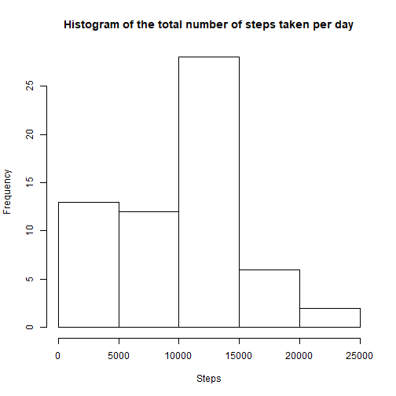
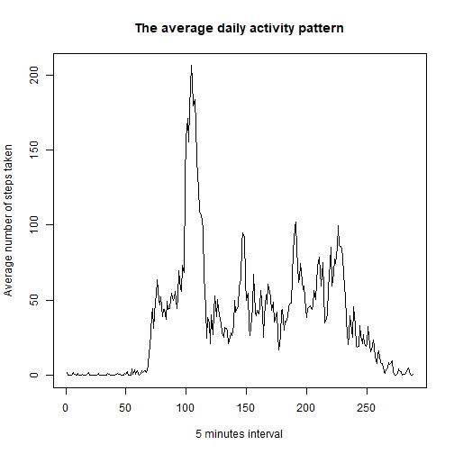
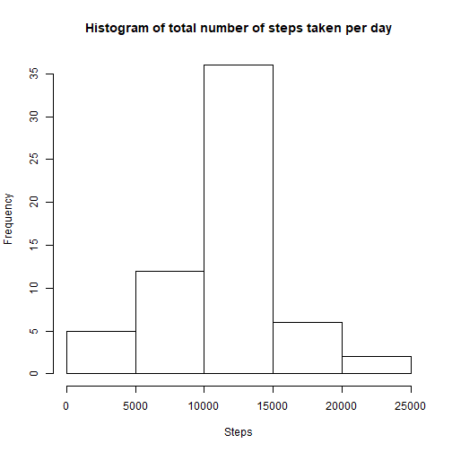
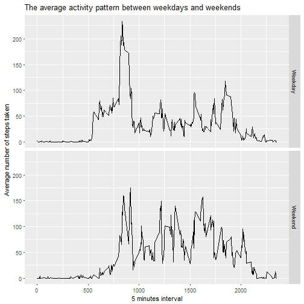

#This is the R markdown doc for reproducible research assignment 1

##Loading and preproceesing the data

1. Load the data (i.e. read.csv())
2. Process/transform the data (if necessary) into a format suitable for your analysis


```r
rawdata <- read.csv("activity.csv", header = TRUE, sep=",",na.strings="NA")
head(rawdata)
```

```
##   steps       date interval
## 1    NA 2012-10-01        0
## 2    NA 2012-10-01        5
## 3    NA 2012-10-01       10
## 4    NA 2012-10-01       15
## 5    NA 2012-10-01       20
## 6    NA 2012-10-01       25
```

```r
summary(rawdata)
```

```
##      steps                date          interval     
##  Min.   :  0.00   2012-10-01:  288   Min.   :   0.0  
##  1st Qu.:  0.00   2012-10-02:  288   1st Qu.: 588.8  
##  Median :  0.00   2012-10-03:  288   Median :1177.5  
##  Mean   : 37.38   2012-10-04:  288   Mean   :1177.5  
##  3rd Qu.: 12.00   2012-10-05:  288   3rd Qu.:1766.2  
##  Max.   :806.00   2012-10-06:  288   Max.   :2355.0  
##  NA's   :2304     (Other)   :15840
```

##What is mean total number of steps taken per day?
1. Calculate the total number of steps taken per day
2. If you do not understand the difference between a histogram and a barplot, research the difference between them. Make a histogram of the total number of steps taken each day
3. Calculate and report the mean and median of the total number of steps taken per day


```r
NumofStepsperday <- tapply(rawdata$steps, rawdata$date, sum, na.rm=TRUE)
hist(NumofStepsperday,main = "Histogram of the total number of steps taken per day", xlab="Steps")
```




```r
### the mean of the total number of steps taken per day
Mean_NumofStepsperday <- mean(as.integer(NumofStepsperday))

### the median of the total number of steps taken per day
Median_NumofStepsperday <- median(as.integer(NumofStepsperday))
```

The mean of the total number of steps taken per day is 9354.2295082.
The median of the total number of steps taken per day is 10395.

##What is the average daily activity pattern?
1. Make a time series plot (i.e. type = "l") of the 5-minute interval (x-axis) and the average number of steps taken, averaged across all days (y-axis)
2. Which 5-minute interval, on average across all the days in the dataset, contains the maximum number of steps?


```r
AverageofStepsPer5mins <- tapply (rawdata$steps, rawdata$interval, mean, na.rm=TRUE)
plot(AverageofStepsPer5mins, type="l",xlab = "5 minutes interval", ylab="Average number of steps taken", main="The average daily activity pattern")
```




```r
MaxSteps <- max(AverageofStepsPer5mins)
MaxInterval <- names(which(AverageofStepsPer5mins ==MaxSteps))
```
The maximum number of steps, on average across all the days in the dataset, is 206.1698113, and it is in the interval of 835.

##Importing missing values
1. Calculate and report the total number of missing values in the dataset (i.e. the total number of rows with NAs)
2. Devise a strategy for filling in all of the missing values in the dataset. The strategy does not need to be sophisticated. For example, you could use the mean/median for that day, or the mean for that 5-minute interval, etc.
3. Create a new dataset that is equal to the original dataset but with the missing data filled in.
4. Make a histogram of the total number of steps taken each day and Calculate and report the mean and median total number of steps taken per day. Do these values differ from the estimates from the first part of the assignment? What is the impact of imputing missing data on the estimates of the total daily number of steps?


```r
Missingvalue =sum(is.na(rawdata))
```
The total number of missing values in the dataset is 2304.


```r
## filling the missing values in the dataset
Reviseddata <-rawdata
for (i in 1:nrow(Reviseddata))
{  if(is.na(Reviseddata$steps[i]))
{Reviseddata$steps[i] <- AverageofStepsPer5mins[as.character(Reviseddata$interval[i])]
}
}
```


```r
##check if all the missing values are filled
sum(is.na(Reviseddata))
```

```
## [1] 0
```


```r
Rev_AverageofStepsPer5mins <- tapply(Reviseddata$steps, Reviseddata$date, sum)
hist(Rev_AverageofStepsPer5mins, main="Histogram of total number of steps taken per day", xlab ="Steps")
```




```r
### the mean of the total number of steps taken per day
Mean_Rev_AverageofStepsPer5mins<- mean(as.integer(Rev_AverageofStepsPer5mins))
### the median of the total number of steps taken per day
Median_Rev_AverageofStepsPer5mins<- median(as.integer(Rev_AverageofStepsPer5mins))
```
The mean of the total number of steps taken per day is 1.0766164 &times; 10<sup>4</sup>.
The median of the total number of steps taken per day is 10766.

Comparing the filled dataset with the raw dataset, it is found that the mean and median of the total number of steps taken per day changed very little. Given the stragegy taken for filling the missing value using the mean value, the impact is negligible.

##Are there differences in activity patterns between weekdays and weekends?
1. Create a new factor variable in the dataset with two levels - "weekday" and "weekend" indicating whether a given date is a weekday or weekend day.
2. Make a panel plot containing a time series plot (i.e. type = "l") of the 5-minute interval (x-axis) and the average number of steps taken, averaged across all weekday days or weekend days (y-axis). See the README file in the GitHub repository to see an example of what this plot should look like using simulated data.


```r
library(ggplot2)
rawdata$date <-as.Date(as.character(rawdata$date))
rawdata$week[weekdays(rawdata$date) %in%c("Saturday", "Sunday")] <-"Weekend"
rawdata$week[!weekdays(rawdata$date) %in%c("Saturday", "Sunday")] <-"Weekday"
rawdata$week <- as.factor(rawdata$week)
weekdata <- aggregate(steps ~ interval +week, data = rawdata, mean, na.rm=TRUE)
ggplot(weekdata, aes(interval, steps))+geom_line()+facet_grid(week ~.)+labs(x="5 minutes interval")+labs(y="Average number of steps taken")+labs(title="The average activity pattern between weekdays and weekends")
```




From these two plots, we can see the activity pattern between weekdays and weekends are different.
